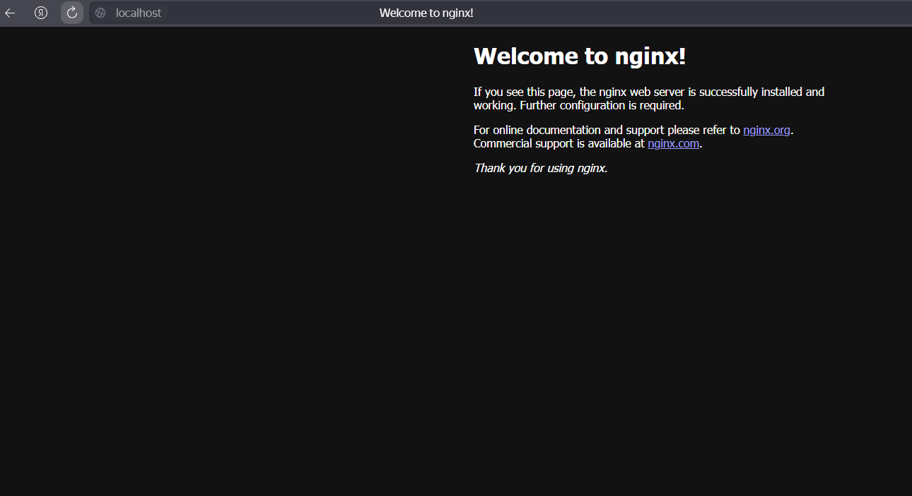

# DO5_SimpleDocker  

## Part 1. Готовый докер  

**1. Скачаем официальный образ nginx**  
  

**2. Проверим наличие образа**  
  

**3. Запустим докер-образ**  
  

**4. Проверим, что контейнер запустился**  
  

**5. Посмотрим информацию о контейнере через ```docker inspect [container_id|container_name]```**  
- Размер контейнера  
  
- Список замапленных портов  
  
-  ip контейнера  
  

**6. Остановим докер контейнер**  
  

**7. Проверим, что контейнер остановился**  
  

**8. Запустим докер с портами 80 и 443 в контейнере, замапленными на такие же порты на локальной машине**  
  

**9. Проверим, что в браузере по адресу localhost:80 доступна стартовая страница nginx**  
  

**10. Перезапустим докер контейнер**  
  

**11. Проверим, что контейнер запустился**  
  

## Part 2. Операции с контейнером  

**1. Прочитаем конфигурационный файл nginx.conf внутри докер контейнера через команду exec**  
  

**2. Создадим на локальной машине файл nginx.conf и настроем в нем по пути /status отдачу страницы статуса сервера nginx**  
  

**3. Скопируем созданный файл nginx.conf внутрь докер-образа**  
  

**4. Перезапустим nginx внутри докер-образа через команду exec**  
  

**5. Проверим, что по адресу localhost:80/status отдается страничка со статусом сервера nginx**  
  

**6. Экспортируем контейнер в файл container.tar через команду export.**  
  

**7. Остановим контейнер**  
  

**8. Удалим образ nginx**  
  

**9. Удалим остановленный контейнер**  
  

**10. Импортируй контейнер обратно через команду import**  
  

**11. Запустим импортированный контейнер**  
  

**12. Проверим, что по адресу localhost:80/status отдается страничка со статусом сервера nginx**  
  
